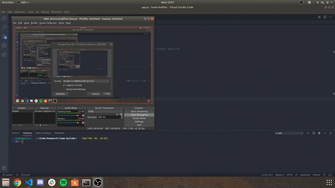

# Team Builder

## Team Builder takes a user input through Node JS and builds an HTML page that displays the team that the user selected and inserted parameters for.

## Installation

npm i

Create a folder called "output" in the same file directory as the app.js file. 

## Technologies Used

Inquirer - npm i inquirer

Jest - npm i jest

## Usage

This application is used to take user input and display a team on an HTML web page to be viewed. Upon running the app.js file, the user is required to input a manager's information first. The information includes name, id, email and office number. Once that is completed the user's input is pushed into an array that stores any employees the user adds.

Once the first manager is pushed into the array, the user is prompted with choices to add new employees. The choices include Engineer, Intern, or to be "done" with adding new employees. If the user adds an engineer, they will be asked for the name, id, email, and github username of the engineer. If the user selects intern, they will be asked for the name, id, email, and school that the intern attends. Each time the user adds an employee they are pushed to the employees array.

Once the user is finished adding employees, they select done at the user prompt. At this point, the app.js file renders the employees array to an html variable. That html variable is then written to a predefined output path. The index.html file will be created and can be deployed displaying the team that the user created.

## Project Status

This project is completed.

## Credits

Collaborator(s) - Justin Kellogg  

## License

https://github.com/justinkellogg89/team-builder
https://justinkellogg89.github.io/team-builder/